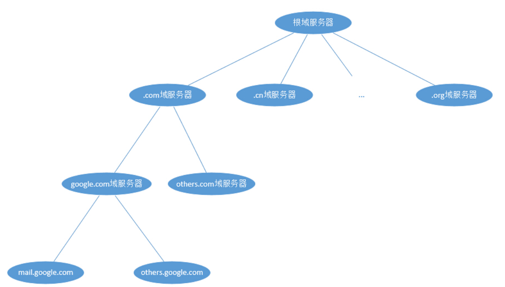
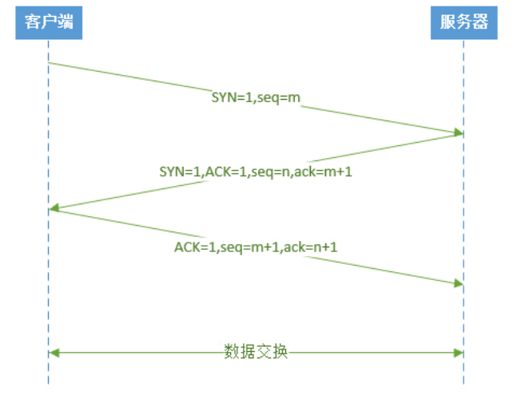

# 关于一次请求生命周期的思考

## 1. DNS解析

####*什么是DNS解析？当用户输入一个网址并按下回车键的时候，浏览器得到了一个域名。而在实际通信过程中，我们需要的是一个IP地址。因此我们需要先把域名转换成相应的IP地址，这个过程称作DNS解析。*

####       1) 浏览器首先搜索浏览器自身缓存的DNS记录。

　　或许很多人不知道，浏览器自身也带有一层DNS缓存。Chrome 缓存1000条DNS解析结果，缓存时间大概在一分钟左右。

　　（Chrome浏览器通过输入：chrome://net-internals/#dns 打开DNS缓存页面）

#### 　　2) 如果浏览器缓存中没有找到需要的记录或记录已经过期，则搜索hosts文件和操作系统缓存。

　　在Windows操作系统中，可以通过 ipconfig /displaydns 命令查看本机当前的缓存。

　　通过hosts文件，你可以手动指定一个域名和其对应的IP解析结果，并且该结果一旦被使用，同样会被缓存到操作系统缓存中。

　　Windows系统的hosts文件在%systemroot%\system32\drivers\etc下，linux系统的hosts文件在/etc/hosts下。

#### 　　3) 如果在hosts文件和操作系统缓存中没有找到需要的记录或记录已经过期，则向域名解析服务器发送解析请求。

　　其实第一台被访问的域名解析服务器就是我们平时在设置中填写的DNS服务器一项，当操作系统缓存中也没有命中的时候，系统会向DNS服务器正式发出解析请求。这里是真正意义上开始解析一个未知的域名。

　　一般一台域名解析服务器会被地理位置临近的大量用户使用（特别是ISP的DNS），一般常见的网站域名解析都能在这里命中。

#### 　　4) 如果域名解析服务器也没有该域名的记录，则开始递归+迭代解析。

　　这里我们举个例子，如果我们要解析的是mail.google.com。

　　首先我们的域名解析服务器会向**根域服务器**（全球只有13台）发出请求。显然，仅凭13台服务器不可能把全球所有IP都记录下来。所以根域服务器记录的是com域服务器的IP、cn域服务器的IP、org域服务器的IP……。如果我们要查找.com结尾的域名，那么我们可以到com域服务器去进一步解析。所以其实这部分的域名解析过程是一个树形的搜索过程

  根域服务器告诉我们**com域服务器**的IP。

　　接着我们的域名解析服务器会向**com域服务器**发出请求。根域服务器并没有mail.google.com的IP，但是却有**google.com域服务器**的IP。

　　接着我们的域名解析服务器会向**google.com域服务器**发出请求。...

　　如此重复，直到获得mail.google.com的IP地址。

 

　　为什么是递归：问题由一开始的本机要解析mail.google.com变成域名解析服务器要解析mail.google.com，这是递归。

　　为什么是迭代：问题由向根域服务器发出请求变成向com域服务器发出请求再变成向google.com域发出请求，这是迭代。

​       为什么全球只有13台根服务器 : 因为UDP给ip只有512个字节要把13个根服务器存储进去

#### 　　5) 获取域名对应的IP后，一步步向上返回，直到返回给浏览器。

## 2.补充一点CDN知识

### CDN 是什么

​       **CDN**（Content Delivery Network，内容分发网络），即全网内容加速服务。为了尽可能的避开互联网上有可能影响数据传输速度和稳定性的瓶颈和环节，使内容传输的更快、更稳定，由此，诞生了 CDN 加速服务。

通过ip/为止找最近的 距离用户最近的资源服务器

## 3.建立tcp链接

##4.服务端负载

   根据自己公司的负载架构 指定具体某台服务器处理这次请求

​    当网络不太好时TCP使用 拥塞控制 

​     慢开始: 先探测 由小到大 逐渐增大网络包

​    拥塞避免: 记录往返的RTT时间  计算发包时间大小

   快重传 &快恢复 : 收到网络包立刻恢复 不等数据返回稍带回复 

