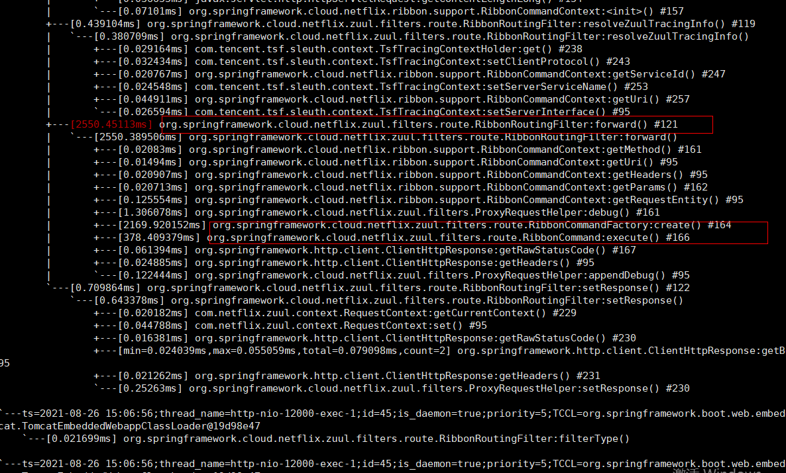

### spring cloud 项目首次访问慢分析

​     

 将问题锁定在RibbonCommandFactory 对象创建上

 如何优化首次加载慢的问题

   ```shell
# 使用饥饿加载
ribbon.eager-load.enabled=true
ribbon.eager-load.clients=下游服务名
   ```

普通服务发现使用这个方法可以得到一定提升,但是 网关虽然也优化了但是, 首次加载依然没有达到理想效果

后期想到了一种方案: 

1. 网关启动后去注册中心拉取下游服务的api 信息,  每个服务实现一个health接口 网关调取这个接口预热

   ​         通过定位发现可能跟熔断插件有关系

2. 这个接口 有个状态标志自己是否被预热过,如果预热过直接返回,没有找一个字节的下游服务进行预热